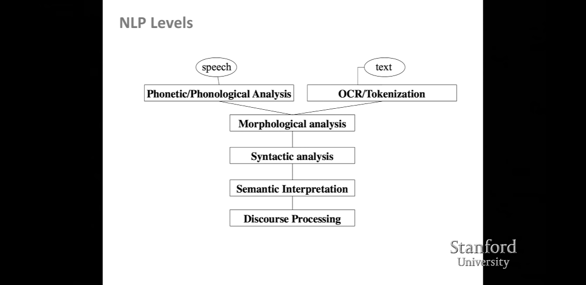

# Lecture 1 - CS224 NLP with Deep Learning

(Spring 2016) http://cs224d.stanford.edu/lecture_notes/notes1.pdf

https://www.youtube.com/watch?v=OQQ-W_63UgQ&list=PL3FW7Lu3i5Jsnh1rnUwq_TcylNr7EkRe6

## What is NLP?

Intersection of a number of fields ... Computer Science ... Artificial Intelligence and Linguistics.

Goal is to "understand" natural language. To perform useful tasks.

... Siri, Google Assistant, Facebook M, Cortana (mobile was a huge driver for this)

## NLP Levels

This illustrates:

- Top level, the transportation of the language, speech or text.
- Morphological analysis... structure of words, beginnings and endings.
- Syntactic analysis ... structure of sentences.
- Semantic Interpretation... meaning of sentences.
- Discourse Processing... need to understand the context of the sentence.

## NLP Applications

- spell checking / auto complete on phone / searching on web
- extracting information - like prices, dates and locations etc
- classifying - sentiment analysis - positive or negative.
- future - machine translation / spoken dialog systems / complex question answering.

## NLP in Industry

Machine translation - huge breakthroughs recently...
... lots speech recognition and chatbots

## What's special about the human language?

.. unlike signal processing on vasts amounts of data.
Its specifically constructed to convey meaning.

Complex system but kids can learn easily
Discrete symbolic signaling system - which are reliable units

Something interesting as what they want to communicate is symbols but the way we use to communicate is to use a "continuous substrate" ... sound (speech), gesture (sign-language), images (text).

Communication medium is continuous... what happens after that?
Brain is also a continuous system - not a symbolic processor.
Have continuous activation. So what we are doing using language is going from:

*continuous* -> *symbolic* -> *continuous*

The problem for Machine Learning is sparsity - as languges have huge vocabs... some even thought to be infinite (productive morphology)

## What is Deep Learning (DL)

- DL is a subfield of Machine Learning (ML)
- ML methods work because humans design the features to be used.
- Like Google search (signal=feature) devs experimented by adding new ones each month.
- So ML just becomes an exercise in optimisation of feature weighting to get best prediction - Machine not learning much but human learning a great deal. (linear classifier)

## ML vs DL

- ML in practice is a human describing a problem in terms of features so the computer can understand (> 90%) with only a small percentage take with the computer doing any actual learning.
- DL uses
  - Representation learning, attemtps to learn features for itself
  - DL - multiple layers of representations - so out-perform other learning techniques... now it means using neural networks.

## History of Deep Learning

- Focus on different types of nueral networks.
- Not the only way - probablistic models etc.
- "Neural" terminology - just stacked generalised linear models. But there is something qualitively different - as behaviour in ways of doing things is so much different than that of statistics.
- History is long and boring... see article by Jurgen Schmidhuber

## Why DL

- Manually designed features are often over-simplified, incomplete and take a long time to design and validate.
- Learned Features are easy to adapt and fast to learn.
- Used in both un/superviesed sessions.
- Massive progress in recent years with new products.

A lot of the key techniques were invented in 80's and 90's

- Technology advances
- Large amount of training data now. Faster machines - more CPU/GPU multi cores.
- Vector processing - marriage between DL and GPUs

## DL in Speech

- first big breakthough - Dahl et al. (2010)
- traditionally using acoustic analysis (guassian mixture models and hidden markov models)... honing little by little.
- DL instantly gave a decrease of about 30% in word error rate.

## DL in Computer Vision

- second breakthrough - classification of objects
- again 27% error reduction (Zeiler & Ferfus 2013)

## Why is DL hard?

TBD (42 mins 29 seconds into Video)